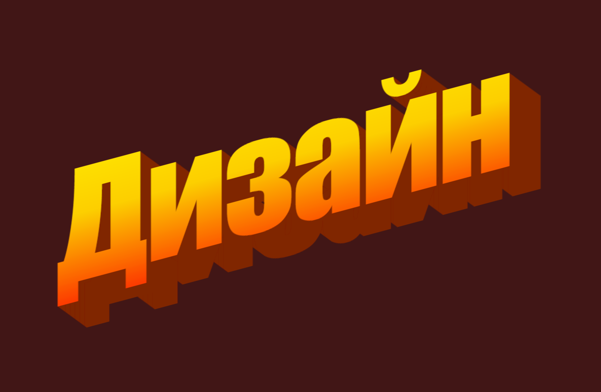
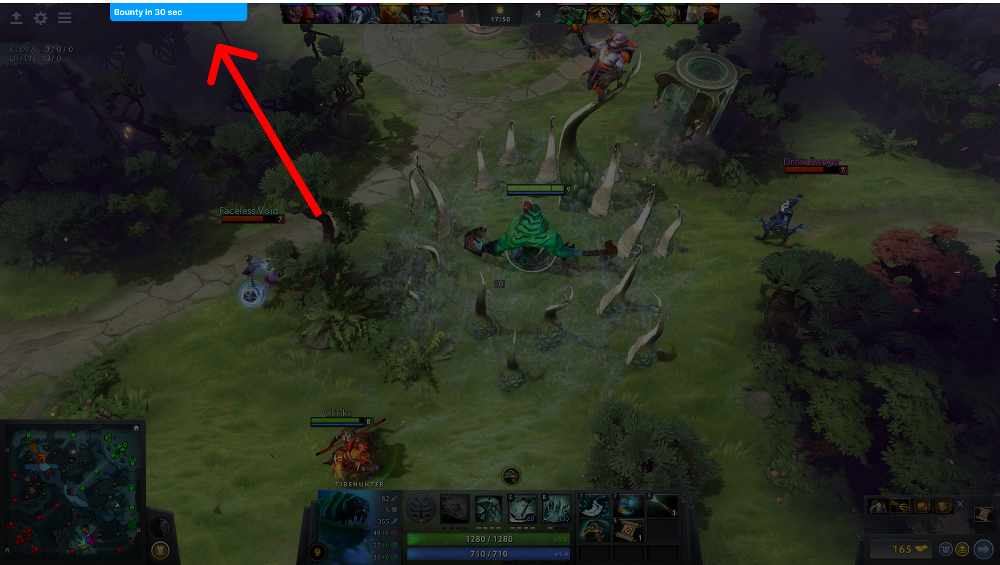
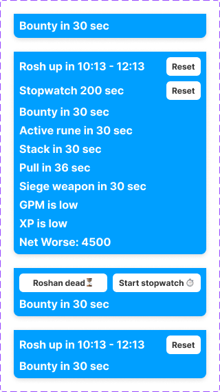

> Эта история берёт начало [на Хабре](https://habr.com/ru/post/543354/)

Вообщем я решил что пора бы обновить оверлей [dota-helper](https://github.com/Luchanso/dota-helper), который помогает играть в доту, выглядит он примерно так:

После составление [небольшого плана](https://github.com/Luchanso/dota-helper/issues/57), я приступил к итеративному обновлению

## Чистим проект

Проект слегка покрылся паутиной, поэтому его нужно было сначала обновить - для этого был поставлен [Renovate Bot](https://renovatebot.com/), который начал в автоматическом режиме открывать PR'ы на обновление зависимостей, а Github Actions (CI) в свою очередь проверял собирается ли проект. Так все зависимости за неделю были обновлены. Параллельно с этим был осуществлён [переезд на Yarn 2](https://yarnpkg.com/getting-started/migration) aka Berry, чтобы снизить нагрузку на диск и ускорить установку зависимостей. После было удалено пару файликов и с проектом стало комфортно работать. Дальше я начал накидывать дизайн в Figma.

По собственному опыту использования тулзы, 90% функционала оказалось бесполезным. Все эти цифры - GPM, XPM, и другие никак не помогают в игре. Оставшиеся 10%, - это звуковое оповещение о том что пора брать руну богатства и таймер на рошана, они оказались полезными, и вот почему:

Одна Bounty руна даёт от 40 золота каждому члену команды, или легчайшие 40 \* 5 = 200 золота, это всё ровно что убить саппорта. Поэтому за этой руной необходимо посматривать.

Roshan - было огромное количество ситуаций, когда команда экономила время на проверках наличия этого зверька на месте. Также таймер подсказывал команде, когда нужно начинать подготовку (расстановка обзора и планирование) к походу.

Учитывая весь предыдущий опыт, решено убрать все цифры и оставить только **оповещения** о важных событиях, которые обычно по ходу игры забываются. Ещё хотелось изменить цвет плашки, так как он сливался с фоном игры (хотя изначально так и было задумано), и увеличить размер шрифта. Поэтому новый вариант будет выглядеть так:

После 10-ой минуты будут появляться две кнопки, одна для запуска Rosh таймера, вторая для запуска секундомера. Секундомер нужен, чтобы отсчитывать время отката способностей вражеской команды, например, через сколько будет Black Hole у Энигмы.

Список вещей, которые хотелось бы видеть:

- Таймер рошана
- Секундомер
- Таймер на баунти руну
- Таймер на активную руну
- Таймер на начало стака и отводов
- Таймер, который оповещает о том, что пошли катапульты
- Информация о том, что скоро ночь
- Другая мета информация, которая подсказывает о текущем состоянии стиля игры

Также хотелось бы иметь немного подсказок о том, какие предметы купить и в какой последовательности скилы взять, но это уже гораздо сложнее отрисовать, поэтому эта фича останется для следующих версий. В целом на дизайне всё.

## Причём тут Rust?

Уже давно хочется опробовать этот язык программирования в действии. Поэтому я начал с простого переписывания GSI сервера (Game State Integration), который написан на NodeJS/Express. Ещё одна причина переписывания - это трудности упаковки NodeJS приложения в бинарник. Бинарное приложение необходимо, чтобы упростить установку помощника для конечных пользователей, да и сейчас запуск приложения в Dev режиме без оптимизаций занимает секунд 30, что не очень комфортно.

Моё знакомство с Rust не первое, и на С++ до этого много писал, но не обошлось без боли в виде долгого чтения документаций и поиска ответа в гугле. Но не смотря на трудности, ядро [было заложено](https://github.com/Luchanso/dota-helper/commit/3179a8b5cd8dd086f6b4031f52b0073d7301ba1e).

Выбор веб сервера для Rust пал на [Hyper](https://hyper.rs/). Парсинг осуществляется через serde либу. Мне удалось на первых этапах запустить сервер и получить состояние из игры во время просмотра матча, а также записать его в файлик для дальнейшего анализа. Теперь осталось дело за малым - описать все типы приходящих данных, чтобы осуществить их корректный парсинг в Rust и далее записать стейт игры в память, чтобы потом отдавать на фронт через GraphQL API.

На этом я заканчиваю первую часть, как только доделаю интересные вещи, напишу вторую часть 👋
